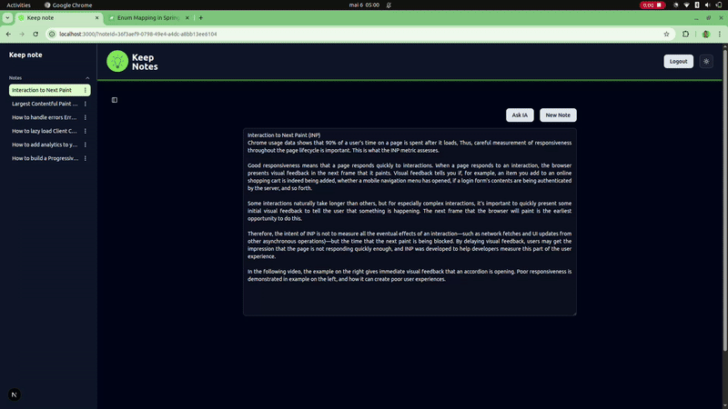

# Keep Note

Keep Note is a simple and efficient note-taking application designed to help you organize your thoughts and ideas.
Use AI to resume your note(s)
- Inspired by a modern [google keep](https://keep.google.com/) web applications.



## Features

- [x] CRUD  note
- [x]  Note archiving
    - [x] List of normal notes
    - [x] List of notes archived
- [x] Search functionality to quickly find a note<span style="color: green;"> **[Coming Soon]**</span>.
- [ ] AI to ask anything about
    - [x] a note : Maximum `10 questions Starter Plan`
    - [ ] a list of notes selected : `unlimited questions` <span style="color: green;"> **[Coming Soon]**</span><span style="color: gold;"> **(Premium version)**</span>
    - [x] voice to ask a question<span style="color: gold;"> **(Premium version)**</span>
- [ ] <span style="color: SaddleBrown;"> **Mobile app (Pwa)**</span><span style="color: green;"> **[Coming Soon]**</span>
- [*] Organize notes by tags<span style="color: green;"> **[Coming Soon]**</span><span style="color: gold;"> **(Premium version)**</span>.
- [x][SEO](https://vercel.com/moufids-projects-7c2d1e82/eblog/F1BrM7v3PnnGTVshoh6XwFQUzoV7/og)
- [ ][Policies](https://supabase.com/dashboard/project/mmjhsaeghpanhtoqbhik/auth/policies)
- [ ][cookies]()

## Pages
- Landing page
- User dashboard page

## Installation & run

1. Clone the repository:
    ```bash
    git clone https://github.com/Moufid17/keep-note.git
    ```
2. Navigate to the project directory:
    ```bash
    cd keep-note
    ```
3. Create and fill `.env` file :
    ```
    # Database Config (Supabase)
    DATABASE_URL=

    SUPABASE_URL=
    SUPABASE_ANON_KEY=

    # Open IA
    OPENAI_API_KEY=

    # App config (local)
    NEXT_PUBLIC_BASE_URL=http://localhost:3000
    ```

    NB : <br/>
    - Production app config <br/>
        ```
        NEXT_PUBLIC_BASE_URL=<YOUR_PRODUCTION_URL> 
        ```
    
4. Run the app docker images, install dependencies and run it
    ```bash
    make up && make install
    make dev
    ```

4. Open your browser and navigate to `http://localhost:3000`.

## Contributing

Contributions are welcome! Please follow these steps:

## License

This project is licensed under the [MIT License](LICENSE).

## Acknowledgments


