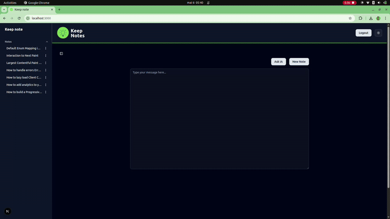

# Keep Note

Keep Note is a simple and efficient note-taking application designed to help you organize your thoughts, tasks, and ideas.
- Inspired by a modern [google keep](https://keep.google.com/) web applications.

## Features

- Create, edit, and archive notes.
- Organize notes with tags or categories `[Coming Soon]`.
- Search functionality to quickly find notes.
- Lightweight and user-friendly interface.

## Contributing

Contributions are welcome! Please follow these steps:

## License

This project is licensed under the [MIT License](LICENSE).

## Acknowledgments

